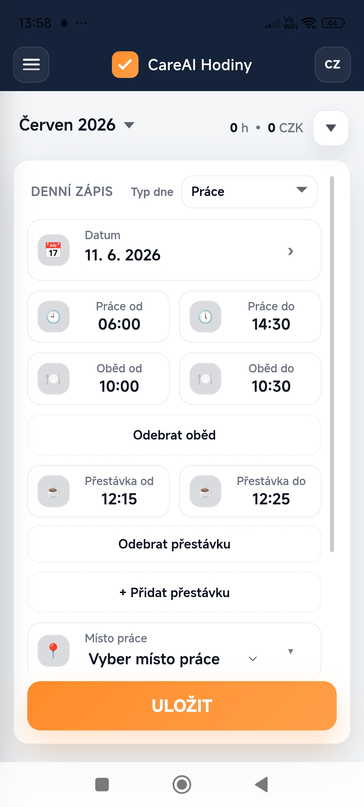
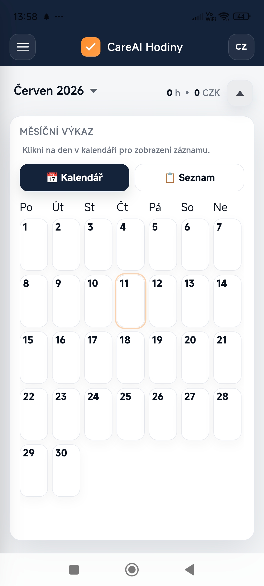
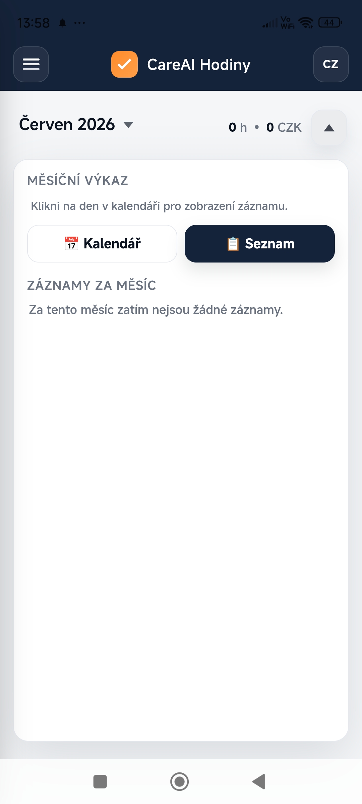
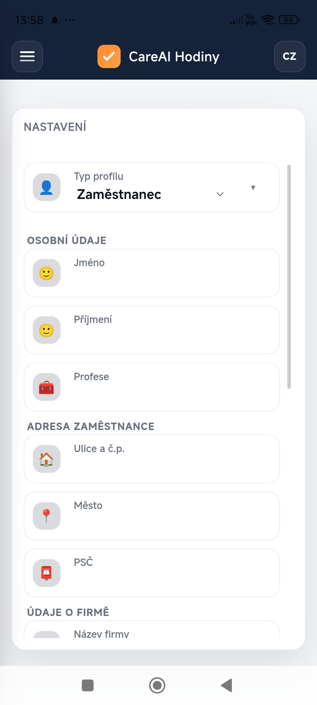
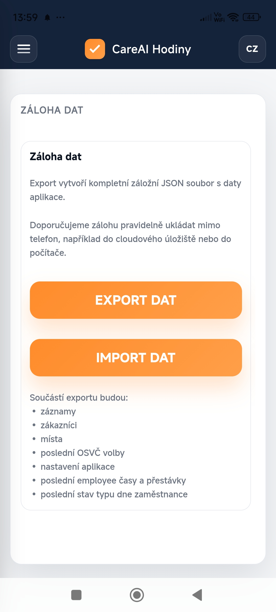
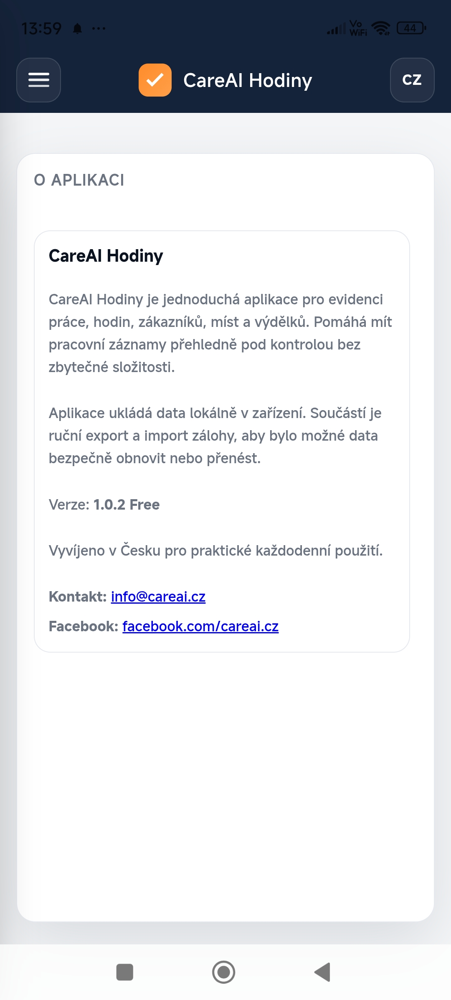
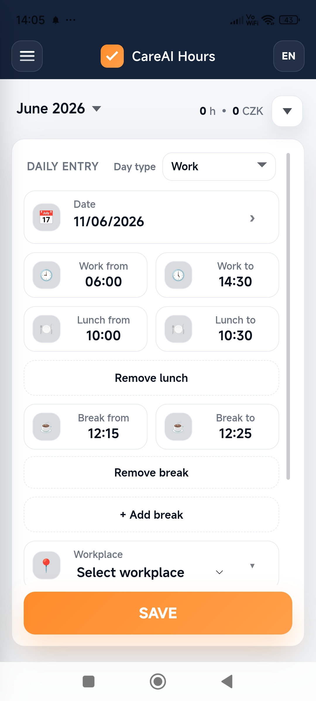

# CareAI Hodiny

Aplikace pro evidenci pracovní doby zaměstnanců a OSVČ.

<h2>Screenshoty</h2>

  
  
  

  
  
  

  

## Hlavní funkce

- Evidence odpracovaných hodin
- Kalendářový přehled
- Měsíční reporty
- Režim zaměstnanec
- Režim OSVČ
- CZ/EN lokalizace
- Export a záloha dat
- Android aplikace přes Capacitor++

## Technologie

- HTML
- CSS
- JavaScript
- Capacitor
- Android Studio

## O projektu

CareAI Hodiny je můj vlastní projekt, který vyvíjím od návrhu přes testování až po publikaci na Google Play.

Cílem aplikace je nabídnout jednoduchý nástroj pro evidenci pracovní doby zaměstnanců i OSVČ.
